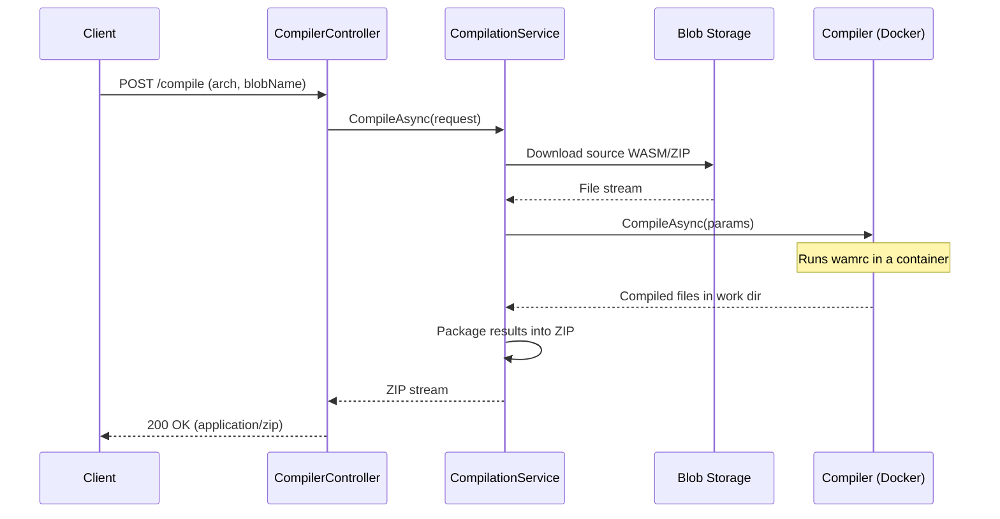
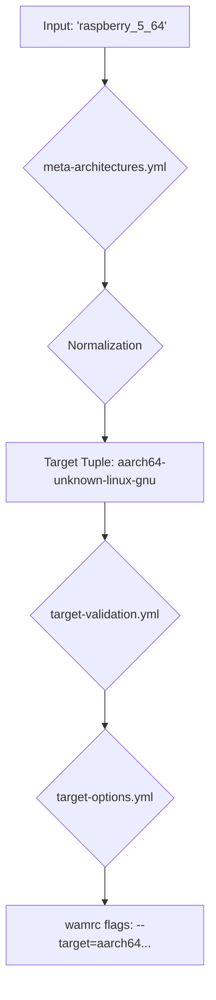

# Compilation Service Architecture

This document outlines the architecture of the Tinkwell Firmwareless Compilation Server. Its primary role is to take WebAssembly (WASM) modules, known as "firmlets," and compile them into native Ahead-Of-Time (AOT) code for various hardware architectures.

## High-Level Flow

The compilation process is initiated by an HTTP request and results in a ZIP archive containing the compiled artifacts.

## Component Breakdown

The service is composed of several key components that work together to handle compilation requests.

*   **`CompilerController`**: The entry point of the service. It exposes a single `POST /api/v1/compiler/compile` endpoint that accepts a JSON payload with the target architecture and the name of the source blob in storage.
*   **`CompilationService`**: The orchestrator. It manages the entire compilation job, including:
    1.  Creating a temporary directory for the job.
    2.  Downloading the source firmlet (either a single `.wasm` file or a `.zip` archive) from Azure Blob Storage.
    3.  Reading the `firmware.json` manifest if present, or creating a default one.
    4.  Invoking the `Compiler` to perform the compilation.
    5.  Packaging the source, compiled AOT files, logs, and metadata into a final `.zip` archive.
    6.  Cleaning up the temporary directory.
*   **`Compiler`**: This component is responsible for the core compilation task. It uses a Docker container (e.g., `wamrc-compiler:latest`) to ensure a consistent and isolated build environment. It generates and executes a shell script within the container that runs the `wamrc` compiler with the appropriate arguments.
*   **`CompilerOptionsBuilder`**: A helper that constructs the precise command-line arguments for `wamrc` by interpreting the configuration defined in the YAML files.

## Configuration

The compilation process is highly configurable through three YAML files. This approach separates the compilation logic from the target-specific details.

1.  **`meta-architectures.yml`**:
    *   **Purpose**: Provides user-friendly aliases for complex target specifications. For example, a user can request `linux` instead of the full `x86_64-pc-linux-gnu`.
    *   **Normalization**: It also defines rules to convert common architecture names (e.g., `x64`, `arm64`) into their canonical forms (`x86_64`, `aarch64`).

2.  **`target-validation.yml`**:
    *   **Purpose**: Defines the valid combinations of architecture, OS, vendor, and ABI.
    *   **Function**: It acts as a guardrail, preventing the server from attempting to compile for unsupported or nonsensical targets (e.g., `x86_64` on `darwin` with a `pc` vendor).

3.  **`target-options.yml`**:
    *   **Purpose**: This is the core configuration file that maps a validated target tuple to the specific flags required by the `wamrc` compiler.
    *   **Flags**: Defines the base compiler flags for each supported target pattern (e.g., `aarch64-*-linux-gnu`).
    *   **Features**: Defines optional, architecture-specific features (e.g., `crypto` for `aarch64`, `avx2` for `x86_64`) that can be enabled to add further compiler flags.

## Supported Architectures

The service supports compiling for a wide range of targets by combining an architecture, OS, and ABI. The underlying compiler is `wamrc` from [WebAssembly Micro Runtime](https://github.com/bytecodealliance/wasm-micro-runtime).

### Base Architectures
*   x86 (i686)
*   x86-64 (x86_64)
*   ARM 32-bit (arm, armv7)
*   ARM 64-bit (aarch64)
*   RISC-V 32-bit (riscv32, rv32)
*   RISC-V 64-bit (riscv64, rv64)

### Supported Combinations (Targets)
The following list shows some of the primary supported target combinations. The vendor (`pc`, `apple`, `unknown`) is often determined automatically.

| Architecture | Operating System | ABI             | Example Target String                |
|--------------|------------------|-----------------|--------------------------------------|
| `x86_64`     | `linux`          | `gnu` / `musl`  | `x86_64-pc-linux-gnu`                |
| `x86_64`     | `windows`        | `msvc` / `gnu`  | `x86_64-pc-windows-msvc`             |
| `x86_64`     | `darwin`         | `none`          | `x86_64-apple-darwin-none`           |
| `i686`       | `linux`          | `gnu` / `musl`  | `i686-pc-linux-gnu`                  |
| `aarch64`    | `linux`          | `gnu` / `musl`  | `aarch64-unknown-linux-gnu`          |
| `aarch64`    | `windows`        | `msvc` / `gnu`  | `aarch64-unknown-windows-msvc`       |
| `aarch64`    | `darwin`         | `none`          | `aarch64-apple-darwin-none`          |
| `armv7`      | `linux`          | `gnueabihf`     | `armv7-unknown-linux-gnueabihf`      |
| `riscv64`    | `linux`          | `gnu` / `musl`  | `riscv64-unknown-linux-gnu`          |
| `riscv32`    | `linux`          | `gnu` / `musl`  | `riscv32-unknown-linux-gnu`          |

