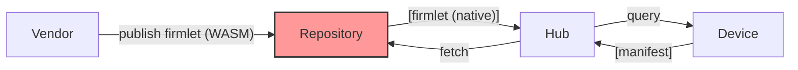
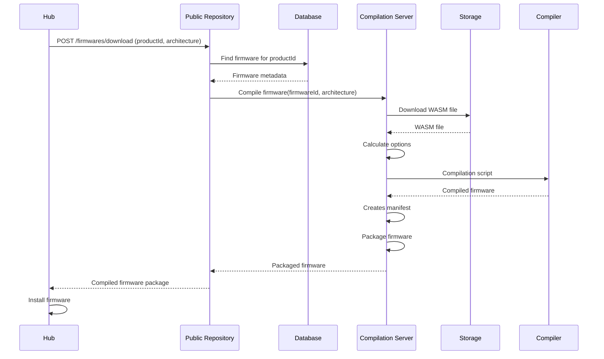

# Public Repository



## Bootstrapping

See also [endpoints and permissions](Endpoints.md).

When testing locally you do not need to repeat the bootstrapping workflow each time, settings are persisted in `Cloud/Source/Tinkwell.Firmless.Cloud/.containers`, delete the whole directory if you want to reset and start from scratch.

In these examples I am using `curl` or the internal tools in `Cloud/Tools` (they are not for production use!) but, if you prefer, you can use `Cloud\Source\Tinkwell.Firmwareless.PublicRepository\Tinkwell.Firmwareless.PublicRepository.http` from within Visual Studio (there are annotated examples ready to use).

All interactions with the API require an API Key, a freshly deployed system doesn't have any but one is created when bootstrapping the system
the first time. It's logged in the "public repository" log, it's valid for a short interval and it has as little permissions as possible. Also a generic
key for hubs (with scope `firmware.download_all`) is created, you can distribute it freely (or create your own, if you want).

* Use the system generated API Key to create a new Admin key with `POST /api/v1/keys`, assign all permissions and set role to `POST Admin`, like this:

    ```bash
    curl -X POST https://your-api-host.com/api/v1/keys \
    -H "Content-Type: application/json" \
    -H "X-Api-Key: your-api-key-here" \
    -d '{
        "Name": "Admin key",
        "Role": "Admin",
        "DaysValid": -1,
        "Scopes": [
            "key.create",
            "key.read",
            "key.revoke",
            "key.delete",
            "vendor.create",
            "vendor.read",
            "vendor.update",
            "vendor.delete",
            "product.create",
            "product.read",
            "product.update",
            "product.delete",
            "firmware.create",
            "firmware.read",
            "firmware.update",
            "firmware.delete",
            "firmware.download_all"
        ]
    }'
    ```
* Now you must revoke the temporary API Key. Find its ID querying `GET /api/v1/keys` and revoke it with `DELETE api/v1/keys/<id>/revoke`.
* Now you can can create a _vendor_:

    ```bash
    curl -X POST https://your-api-host.com/api/v1/vendors \
    -H "Content-Type: application/json" \
    -H "X-Api-Key: your-api-key-here" \
    -d '{ "Name": "Vendor name" }'
    ```

* Then its API key:

    ```bash
    curl -X POST https://your-api-host.com/api/v1/keys \
    -H "Content-Type: application/json" \
    -H "X-Api-Key: your-api-key-here" \
    -d '{
        "Name": "Vendor key",
        "Role": "User",
        "DaysValid": 365,
        "Scopes": [
            "key.create",
            "key.read",
            "key.revoke",
            "vendor.read",
            "vendor.update",
            "product.create",
            "product.read",
            "product.update",
            "product.delete",
            "firmware.create",
            "firmware.read",
            "firmware.update",
            "firmware.delete",
            "firmware.download_all"
        ]
    }'
    ```

* At this point you can use the newly created API key, each vendor is autonomous. You're going to need to create a product (`POST /api/v1/products`)
and then upload its firmwares.

## Publishing Firmwares

* To create a firmware you're going to need to create a zip archive with your firmware (let's say it's called `firmware.wasm`) and a descriptor `firmware.json`:

    ```json
    {
        "EnableMultiThread": false,
        "EnableTailCall": false,
        "EnableGarbageCollection": false,
        "CompilationUnits": ["firmware.wasm"],
        "Assets": []
    }
    ```

    To simplify packaging you can use (when testing locally!) the scripts in `Cloud/Tools`. For example to create a package for your firmware:
    
    ```bash
    python twless.py firmware package firmware.wasm
    ```

* Now you can publish the firmware, using local development tools you can write:

    ```bash
    # $env:TW_REPOSITORY_API_KEY="<your vendor API Key>"
    export TW_REPOSITORY_API_KEY="<your vendor API Key>"
    python twless.py firmware upload <host name> --version=1.0
    ```

## Downloading a firmware

* The hub can download a firmware (the most appropriate version is returned automatically):

    ```bash
    export TW_REPOSITORY_API_KEY="<your vendor or hub API Key>"
    python twless.py firmware download <host name> <product ID>
    ```

### Firmware Download Sequence



If you are interested in the compilation options then read [Compilation.md](./Compilation.md).