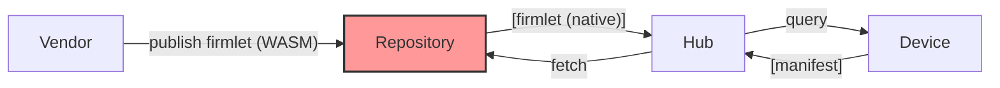
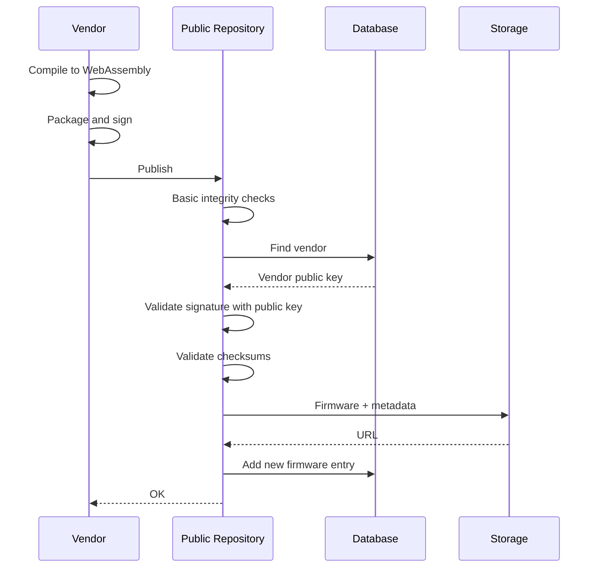
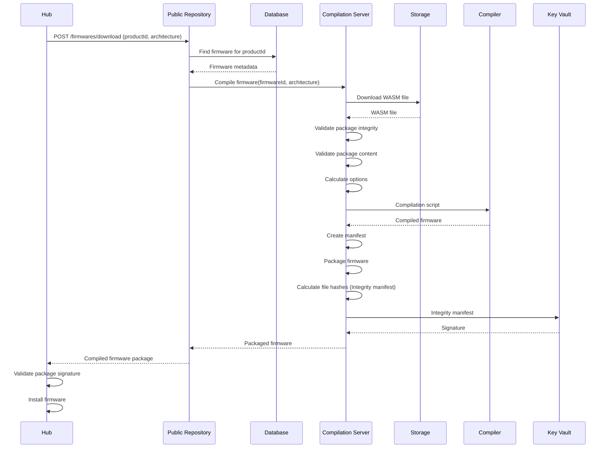

# Public Repository



## See Also

* [Endpoints and Permissions](./Documentation/Endpoints.md).
* [Compilation Process](./Documentation/Compilation.md).
* [Threat Modeling](./Documentation/Threat_Modeling.md).

## Bootstrapping

When testing locally you do not need to repeat the bootstrapping workflow each time, settings are persisted in `Cloud/Source/Tinkwell.Firmless.Cloud/.containers`, delete the whole directory if you want to reset and start from scratch.

In these examples I am using the internal testing tools in `Cloud/Tools` but, if you prefer, you can use `Cloud\Source\Tinkwell.Firmwareless.PublicRepository\Tinkwell.Firmwareless.PublicRepository.http` from within Visual Studio (there are some annotated examples ready to use).

All interactions with the API require an API Key, a freshly deployed system doesn't have any but one is created when bootstrapping the system
the first time. it's valid for a short interval and it has as little permissions as possible. Also a generic
key for hubs (with scope `firmware.download_all`) is created, you can distribute it freely (or create your own, if you want).

* From the .NET Aspire Dashboard take not of the HTTPS endpoint for `tinkwell-public-repository`, for example `"https://localhost:7175"`.
    ```bash
    # In bash (current session only)
    export TW_REPOSITORY_HOST = "<host address>"
    ```
    ```powershell
    # In PowerShell (current session only)
    $env:TW_REPOSITORY_HOST = "<host address>"
    ```
* The temporary API Key is logge in the .NET Aspire Dashboard in the logs for `tinkwell-public-repository`, for example `ak_*********`. You will need it only for the next step. 

* First of all you need to create a new Admin API Key and revoke the termporary one. The command will output the new Admin API Key, keep it in a safe place. You're going to need it to create vendors and to perform some other sensitive operations. 
    ```bash
    ./twless admin bootstrap --api-key <temporary api key>
    ```

* Now you need to create a new vendor. In a production scenario you should receive their public key as PEM, for testing you're going to need to generate one locally. When creating the vendor the command will output its ID, keep note of it.

    ```bash
    ./twless certificate create
    ./twless vendor create "Vendor name" --certificate vendor-certificate.zip --api-key <admin api key>
    ```

* The new vendor needs its own API key to manage its firmwares, create a new one and save it (temporarily) in an environment variable. You have to keep this API key safe. In a production environment you'd want to create a temporary one the vendor can use to bootstrap its own (the same way we did for our Admin API Key).

    ```bash
    ./twless vendor create-key --vendor <vendor id> --api-key <admin api key>
    export TW_REPOSITORY_API_KEY = "<new vendor api key>"
    ```

* Now the vendor is able to create a new product, the command will output its ID, keep note of it.

    ```bash
    ./twless product create <vendor id> "Product name" "Model name"
    ```


## Publishing Firmwares

*  To create a package for your firmware (let's say it's compiled to WebAssembly in `acme.wasm`) you need to package it with its manifest and sign it with your private key (that you created with `./twless certificate create`). Type `./twless firmware package` for further options.
    
    ```bash
    ./twless firmware package acme.wasm --certificate vendor-certificate.zip
    ```

* Now you can publish the firmware, note that you can specify the product ID using the command line but, if omitted, `firmware upload` will fetch the list of products for you to select one - or select automatically if there is only one.

    ```bash
    ./twless firmware upload --version=1.0
    ```


### Firmware Publishing Sequence




## Downloading a Firmware

* The hub can download a firmware (the most appropriate version is returned automatically). Use `--type` if you need to download a device runtime or a service, and `--hardware` to specify the architecture for which you want to compile the firmware. Note that, to download a firmware, you can use your own vendor API key or (better) a low privileges API keys for hubs (like the one automatically generated when the system started the first time).

    ```bash
    ./twless firmware download <vendor id> <product id>
    ```

### Firmware Download Sequence



