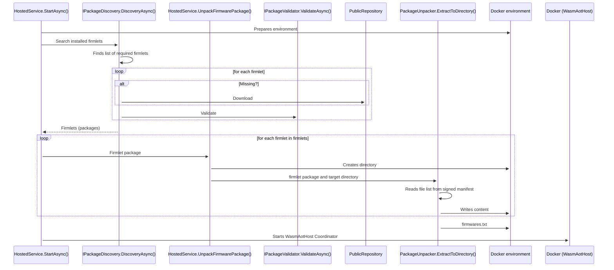
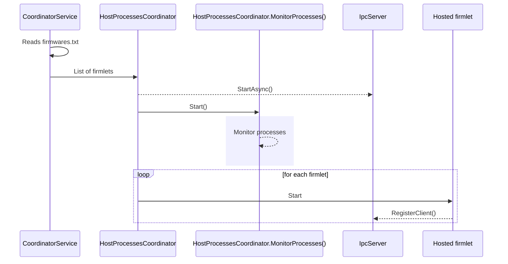
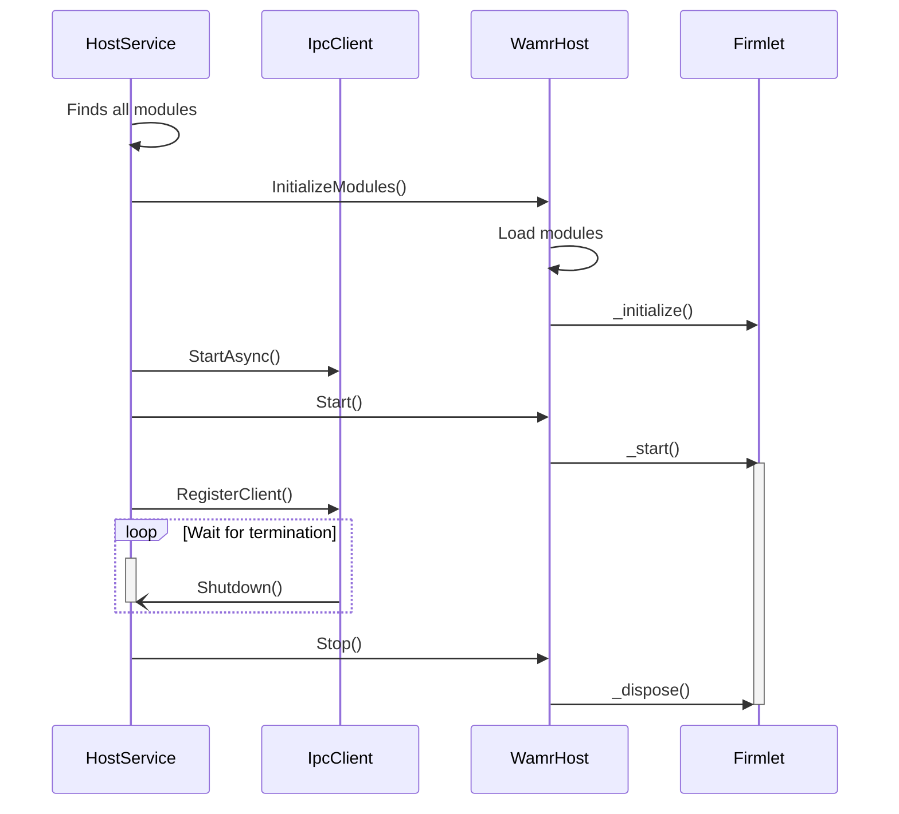
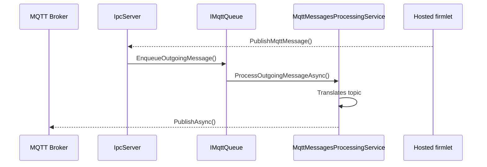
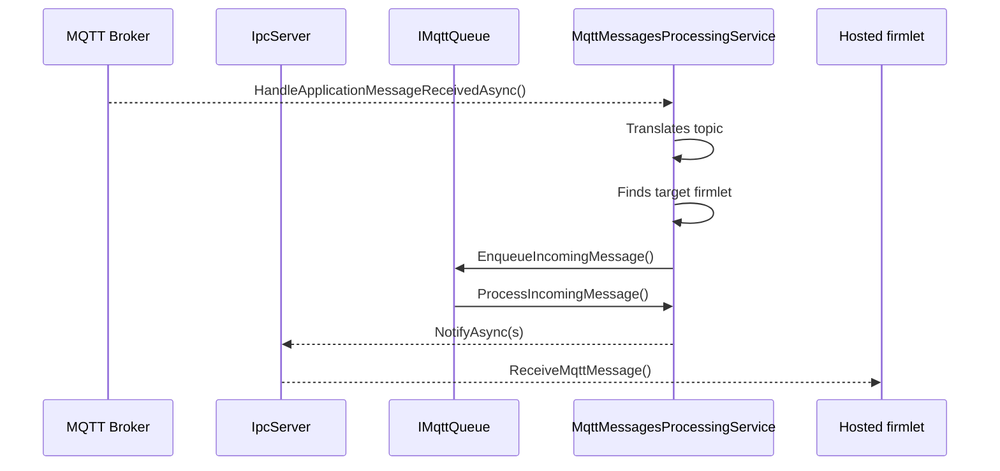

# Tinkwell Firmwareless - Edge Device

This directory contains all the code meant to be executed on an Edge device (the "Hub") and the tools to make
testing and development easier.

## Projects

* **Tinkwell.Firmwareless.Tools.MqttBroker**: this is super simple MQTT broker used for debugging and testing purposes. In a production environment you should always use a proper and well-configured MQTT broker! 
* **Tinkwell.Firmwareless.WasmHost**: This is a _runner_, it can be used alone (when developing) or loaded in Tinkwell Ensamble.
* **Tinkwell.Firmwareless.WamrAotHost**: This is both the coordinator and the host for WASM firmlets. It should run inside a Docker container. You can run this standalone when testing a firmware or debugging an issue. You should at least start (outside the Docker container!) `Tinkwell.Firmwareless.Tools.MqttBroker` to handle MQTT messages. 

## Architecture

See `/Edge/Documentation` for an overall description, this document explain in more detail how `WamrAotHost` works.

`WamrAotHost` is meant to run inside a docker container and invoked from the host system. It communicates with the world outside the container only using MQTT messages. 

### Invocation

It receives from the command line its parameters:

```bash
 WamrAotHost coordinator --path=<PATH> [--mqtt-broker-address=<ADDRESS>] [--mqtt-broker-port=<PORT>] [--mqtt-client-id=<ID>] [--mqtt-topic-filter=<FILTER>]
```
 
Where:

* `--path<PATH>`: Required. Base directory where firmwares to load are saved. It must contains the firmware list firmwares.txt.
+ `--mqtt-broker-address=<ADDRESS>`: Address of the MQTT broker. Can be omitted if specified using the env var `TW_MQTT_BROKER_ADDRESS`.
* `--mqtt-broker-port<PORT>`: Port to contact the MQTT broker. Can be omitted if specified using the env var `TW_MQTT_BROKER_PORT`.
* `--mqtt-client-id=<ID>`: Optional. ID of the MQTT client. Can be specified using the env var `TW_MQTT_CLIENT`. If absent it defaults to "wasm-hosts-container".
* `--mqtt-topic-filter=<FILTER>`: Optional. Filter for the MQTT topic that determines the messages received by the firmlets. If omitted it defaults to "tinkwell/#". You do not usually need to change this parameter.

If the MQTT broker needs credentials then they can be passed using the environment variables `TW_MQTT_CREDENTIALS_USER_NAME` and `TW_MQTT_CREDENTIALS_PASSWORD`.

### Loading

It searches in the directory specified with `--path` for an index file called `firmwares.txt`: it contains the list of all the firmlets to load in the form: `ID="path/to/directory`. The ID is used to identify the firmlet (for example to dispatch the MQTT messages to intended firmlet). Note that this ID is usually stable and it's not exposed to the firmlets (and, as a small security measure, not even to the process hosting the firmlet). Each firmlet receives only its own messages and cannot send messages impersonating another firmlet. In code this ID is called _External Reference ID_.

For each directory specified in `firmwares.txt` the coordinator generates a random ID to identify the firmlet and creates a process (calling itself with the `host` command). The host process knows this ID (in code it's usually called _Host ID_). This ID is not stable and could change (when the system is rebooted or even when a firmlet is terminated/suspended and then resumed).

Let's see the loading sequence starting in Tinkwell.Firmwareless.WasmHost. Its job is to fetch all the firmlets that need to be executed (downloading them if not already available locally) and then start WasmAotHost (in Docker) to execute them.



WasmAotHost has a dual purpose: if executed as _coordinator_ then it communicates with the external MQTT bridge (translating MQTT topics to route messages to the appropriate firmlets) and it starts a new instance of itself (as _host_) to host each firmlet.




The last piece of the puzzle is WasmAotHost acting as _host_ for a firmlet. Note that a firmlet package can contain multiple WASM modules (either in WebAssembly .wasm or AOT compiled .aot). The host will load them all, currently dependencies are not supported but they run in parallel as isolated firmwares running on the same process. They can communicate exchanging messages (like any other external service, just faster); this allows a complex firmware to be split in multiple modules (for example to separate device logic from exposed services).



### Messages

Firmlets communicate through MQTT messages (although it's an implementation detail and the channel itself could be anything else, it's transparent to firmlets).

Messages (outgoing and incoming) are collected by a queue in WasmAotHost (when serving as coordinator) and dispatched appropriately.

An outgoing message looks like this:



While an incoming message is:

