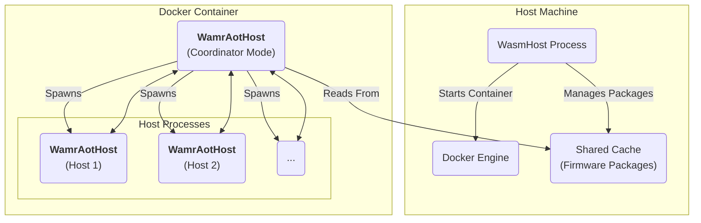
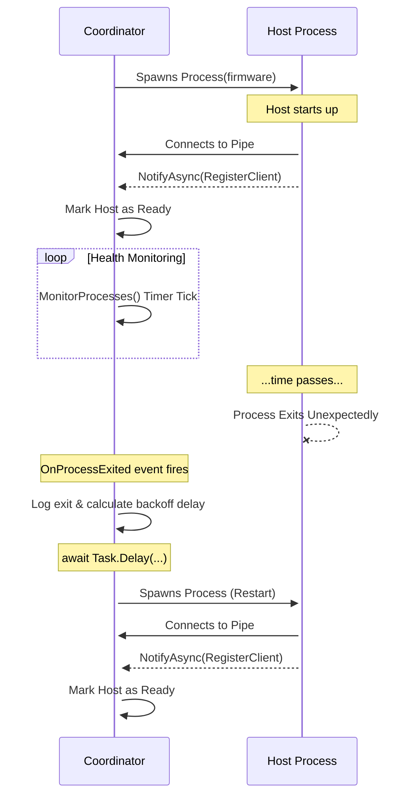

# System Diagrams

This document contains diagrams illustrating the static and dynamic relationship between system components.

---

## 1. Component Diagram

This diagram shows the high-level static components of the system, their relationships, and the boundaries of the container and host machine.

---

## 2. Sequence Diagram: Process Startup & Restart

This diagram shows the dynamic interaction over time between the Coordinator and a single Host process, including the key scenario where a host exits unexpectedly and is restarted by the coordinator's supervision logic.

