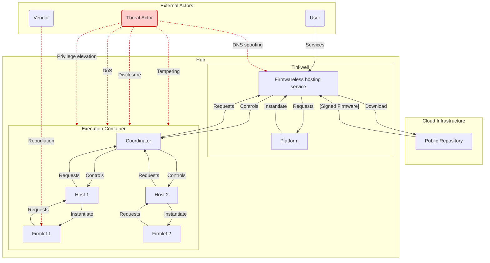

# Threat Modeling: WASM Hosting

This document provides a threat modeling analysis for the Tinkwell Firmwareless projects (`WasmHost` and `WamrAotHost`).

---

### **System Overview & Trust Boundaries**

*   **WasmHost**: Downloads signed firmware packages (`.zip`) from a public repository, validates them, and unpacks them to a local cache directory.
*   **WamrAotHost (Coordinator)**: Runs within a Docker container, scans the cache directory and starts child processes for each firmware. Manages communication between hosts and the Tinkwell host outside the container.
*   **WamrAotHost (Host)**: Runs as a child process within a Docker container, loads a single WASM firmware (composed of one or more modules), and executes it in the WAMR sandbox. Tunnels requests to the coordinator.
*   **Trust Boundaries**:
    1.  **Internet -> WasmHost**: Packages are untrusted until validated.
    2.  **Coordinator <-> Host**: Communication over a local named pipe.
    3.  **Host <-> WASM Module**: The WAMR sandbox is the most critical boundary.

---

### **S**poofing

*Threat: An attacker impersonates a valid component or data source.*

*   **Spoofing the Package Repository:**
    *   **Threat:** An attacker could use DNS spoofing or other network attacks to redirect `WasmHost` to a malicious server.
    *   **Mitigation:** This is well-mitigated. In `PackageValidator.cs`, we verify the `integrity.manifest` using a public key signature (`VerifyManifestSignature`). This ensures that even if the host is redirected, it will reject any package not signed by the legitimate compilation server.

*   **Spoofing a Host Process to the Coordinator:**
    *   **Threat:** A rogue process in the container could try to connect to the coordinator's named pipe and impersonate a valid host.
    *   **Mitigation:** This is well-mitigated. The coordinator generates a unique pipe name and a unique ID for each host, passing them as command-line arguments. An external process would not know these details. The attack surface is limited to other processes within the same container, which implies the container is already compromised.

### **T**ampering

*Threat: Unauthorized modification of data.*

*   **Tampering with a Package at Rest or in Transit:**
    *   **Threat:** An attacker modifies a `.zip` package after it has been published.
    *   **Mitigation:** This is well-mitigated. The `PackageValidator` verifies the signature of the `integrity/manifest.txt` and then verifies the SHA512 hash of every file listed in that manifest. Any tampering with the manifest or the files within the archive will cause the validation to fail, and the package will be discarded.

*   **Tampering with Host Process Memory from WASM:**
    *   **Threat:** A vulnerability in a WASM module allows it to read/write memory outside of its sandbox, affecting the host process.
    *   **Mitigation:** The primary mitigation is the WAMR sandbox itself. Even if compromised, the host has no access to any resource and communication is tunneled through the coordinator (which is a separate process with OS level separation). This is an accepted architectural risk.

### **R**epudiation

*Threat: A user or component denies having performed an action.*

*   **A Malicious Firmlet Denying Its Actions:**
    *   **Threat:** A firmlet performs a malicious action (e.g., sends a malformed MQTT message) but its own logs are clean.
    *   **Mitigation:** The system has a good level of auditing. The coordinator logs critical events like process starts and abnormal exits. The host process logs events from the firmlet via the `tw_log` host function. This provides a centralized audit trail that the firmlet cannot easily repudiate. This is sufficient for this threat.

### **I**nformation Disclosure

*Threat: Exposure of sensitive information to unauthorized individuals.*

*   **WASM Module Reading Arbitrary Files:**
    *   **Threat:** A firmlet reads sensitive files from the container's filesystem (e.g., `/etc/shadow`, environment variables, or other firmslets' files).
    *   **Mitigation:** This is well-mitigated. The `Dockerfile` shows that WAMR is built with `-DWAMR_BUILD_LIBC_WASI=0`, which disables the WASI filesystem APIs. The only way for a module to interact with the outside world is through the host functions you provide (`IHostExportedFunctions`), which do not appear to expose file-access capabilities.

*   **Leaking Secrets to Logs:**
    *   **Threat:** A firmlet handles a secret and passes it to `tw_log`, which then writes it to the system logs in plain text.
    *   **Mitigation:** The `HostExportedFunctions.Log` method logs the topic and message directly. This is a low-to-medium risk. The responsibility is currently on the firmlet developer not to log secrets. For a higher security posture, you could implement a secret-scrubbing filter in the `Log` function, or explicitly document that logging sensitive data is forbidden.

### **D**enial of Service

*Threat: Preventing legitimate users from accessing the service.*

*   **Persistently Crashing Host:**
    *   **Threat:** A host process gets into a state where it crashes immediately on startup, causing an infinite loop of restarts.
    *   **Mitigation:** This is well-mitigated. The `RestartProcessWithBackoffAsync` method in `HostProcessesCoordinator` correctly implements a circuit breaker that stops restarting a host if it fails too many times.

*   **Host Process Consuming Excessive OS Resources:**
    *   **Threat:** A host process consumes too much CPU or memory, impacting the coordinator and other hosts.
    *   **Mitigation:** This is well-mitigated at the OS process level. The `SystemResourcesUsageArbiter` monitors the host process's CPU and memory usage (via `ExponentialMovingAverage`) and terminates it if it exceeds a configured threshold.

*   **WASM Module Infinite Loop:**
    *   **Threat:** A firmlet contains an infinite loop (`while(true){}`). This will consume 100% of a CPU core.
    *   **Existing Mitigation:** Periodic OS-level CPU monitoring in the `SystemResourcesUsageArbiter` will eventually detect this and terminate the process. This is a  *reactive* control.
    *   **Additional Mitigation:** For defense-in-depth, a *proactive* control would be stronger. The WAMR runtime can be configured to limit the number of instructions a function can execute at once ("gas limit"). Implementing a watchdog in the C# host that uses this feature to preemptively kill a long-running WASM function call would provide a faster, more granular defense against this specific threat.

### **E**levation of Privilege

*Threat: An attacker gains capabilities beyond their authorized level.*

*   **WASM Sandbox Escape:**
    *   **Threat:** This is the primary elevation of privilege threat. A vulnerability in the WAMR runtime is exploited by a malicious WASM module, allowing it to execute native code with the full permissions of the host process.
    -   **Mitigation 1 (Least Privilege):** This is well-mitigated. The `Dockerfile` correctly specifies a non-root user (`USER $APP_UID`). This means that even if a sandbox escape occurs, the attacker is contained within the permissions of that user inside the container, not root.
    -   **Mitigation 2 (Read-Only Filesystem):** The container is mounted with a read-only filesystem. This is another defense-in-depth measure that will significantly limit an attacker's ability to cause damage after an escape.
    -   **Remaining Risk (Unsafe Interop):** The bridge between managed C# code and the native WASM module is inherently risky. Functions like `WasmMemory.HighlyUnsafeUtf8PtrToString` are a potential attack surface. A malicious module could try to exploit this by passing crafted pointers to read memory it shouldn't. The code is written defensively, but this `unsafe` boundary remains a high-risk area that requires careful maintenance.
