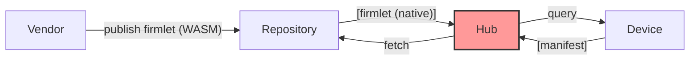

# Firmwareless Host

## See Also

* [Overall Architecture](./Documentation/Overall_Architecture.md)
* [System Diagrams](./Documentation/System_Diagrams.md)
* [Threat Modeling](./Documentation/Threat_Modeling.md)